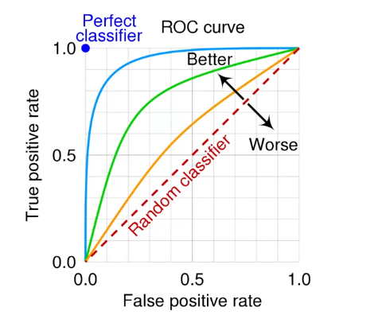

# Common AI Workloads

1. Prediction and Demand Forecasting (*Supervised ML*)
	+ Involves forecasting based on historical data
	+ Think "Line of best fit"
	+ Think "Google Search Suggestion" or "Netflix Recommended System "
1.  Anomaly Detection: ML predicts usual patterns and then anything outside of this range is an `anomaly`
1. Computer Vision
1. Natural Language Processing (NLP)
1. Knowledge Mining
	+ Using AI/ML tools to ingest content like PDFs or SQL tables
1. Content Moderation
1. Generative AI - Goes from basic chat-bots to OpenAI workloads (GPT, DALL-E)

## Common ML Types

1. Regression (Supervised Learning)
1. Classification (Cluster Analysis)
1. Clustering (Unsupervised Learning)
1. Deep Learning (Neural Networks)
	+  Used for image recognition, speech processing, language translation

ML Cheatsheet: [learn.ms](https://learn.microsoft.com/en-us/azure/machine-learning/algorithm-cheat-sheet?view=azureml-api-1)

## Evaluation

> Skipped taking notes here; I've already learned this.

+ False Positive vs False Negatives (FP vs FN)
	+ Choose to optimize a metric based on what you consider important (FP or FN) 

### Confusion Matrix

Data matrix that displays when the model confused a class for another class. Consider classes $C_1, C_2$ and a confusion matrix of 

$$
\begin{pmatrix}
90 & 10 \\
0 & 0
\end{pmatrix}
$$
This matrix[^1] says that $90 \ C_1$ items were laballed correctly yet $10\ C_1$ items were incorrectly labelled as class $C_2$ .

The TPR[^2] (True Positive Rate) and the FPR[^2] (False Positive Rate) are both important measures to determine how good a model is. 

The ROC[^3] curve combines TPR and FPR:

The AUC (Area under curve) is another quantifier that determines how good your ROC curve is. Notice a perfect classifier (ML Model) is 1 AUC. 

There is a lookup table for determining how good a AUROC is. 

[^1]: This matrix is made up; it contains logical inconsistencies. 
[^2]: The TPR and FPR are both percentages. 
[^3]: Receiver Operating Characteristic 