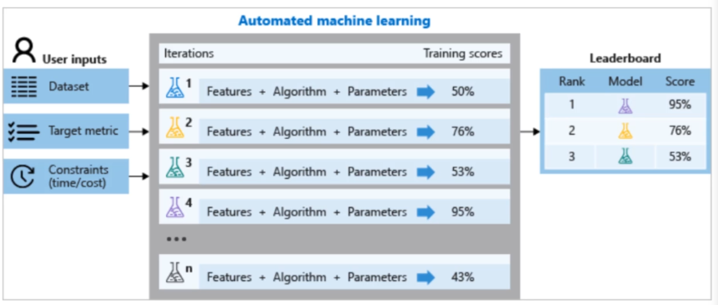
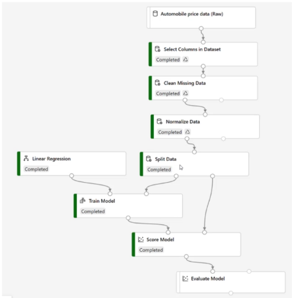

# Auto ML

> No Code

This is known as **auto**mated machine learning under the Azure Machine Learning service.

You only need to choose an SDK and specify the format and output. The underlying engine will find the best algorithms. 

Another related service is the **Azure ML Designer** which is a **drag-and-drop** machine learning synthesizer. Here is a *Azure Designer* example: 

## Azure Machine Learning Workspace

All of the following resources and most future resources require whats known as a Azure ML Workspace: it serves as a namespace/container for your Azure AI workloads. 

### Azure ML Studio

A studio gets generated **with** a workspace (see above). This serves as a playground for any models you want to try out *or* want to share with others.