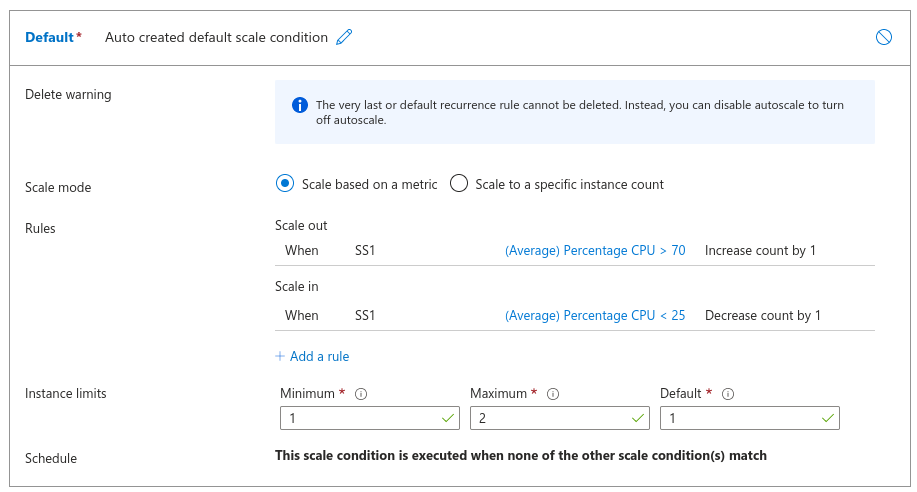

# Azure Virtual Machine Service

## Availability Sets

Let $F$ represent the event that their was a fault in the physical data center and $P$ be the event Azure needs to apply a patch to their servers. 

Availability Sets are used to avoid failures due to events like $F$ or $P$ .

Now you can use Availability Sets to place your VM sets into different
+ Fault Domains: All VMs in a singular fault domain share the same power, network switch, and etc.
	+ Max allowed in one set: $3$
+ Update Domains: A different update domain implies the VMs cannot be updated by Azure at the *same* time.
	+ Max allowed in one set: $20$

These availability sets **do not** cost extra money. 

VM SLAs: [SLAs](https://www.azure.cn/en-us/support/sla/virtual-machines/)

## Availability Zones

See notes from AZ-900. 

+ Use AZs to increase the *availability* of your backend.

## Scale Sets

> Horizontal Scaling

Scale sets increase/decrease the number of **identical** VMs based on CPU load or other metrics.

You **must** define scale in (remove VMs) and scale out (add VMs). 

Example rule:

These rules and metrics are calculated on a *per instance basis*, this implies that if one machine is experiencing stress it may trigger a scale action.

Note each rule can be attached with a cool down where the rule's scale action wont be triggered for $m$ mins after it has been activated once.

> Azure has a guide on best rule practices. 

Scale sets on azure have two modes:
1. Uniform: best for large workloads with one machine type
2. Flexible: used for workloads with many machine types where each VM can be managed independently. 

When you select *uniform*, the VM resources (VM itself, NIC, ...) are not present in the resources menu and thus cannot be managed. Under *flexible*, you can see each individual resource and add new[^1]  VMs to the scale set.

Additional Infomation
+ Scale sets support extensions (see 'Custom Script Extension' in Note 01)
+ Scale sets have something known as an `Upgrade Policy`, this is the policy that defines how VMs in a scale sets are updated. The update refers to changes in a VM configuration such as a new extension being applied. This policy can be made to be automatic or rolling

## VM Images

> Basic knowledge of images and Azure Marketplace is assumed.

You can create custom images to package together custom applications and OSs. This is done by creating an image based on a running machine and place them in a Azure Compute gallery[^1]. 

A image definition is the grouping of image versions where it states why the image was created and other metadata.

There are two types of images:

1. Specialized Images: data about users is retained
2. Generalized Images: data about users it **not** retained. This process of removing user information is known as generalization. 

## Proximity Placement Groups

You can try to ensure VMs are placed on the same physical hardware or near the same hardware to achieve lower latency. Evidently, these would be tied down to a region, you cannot have PPGs inter-region.

When using proximity Placement Groups you need to ensure your VM support and have enabled `accelerated networking`. 

> Azure reccomends that when using these groups you should try to use templates to get the best placements.

[^1]: unprovisioned until now
[^2]: This is what enables sharing and versioning of images