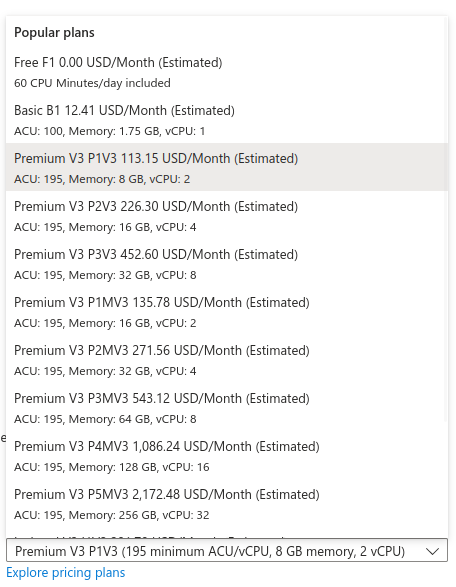

# Azure App Service

Managed PaaS service to deploy web-apps. There are a set of supported languages like Java, Python, Node.js.

## App Service Plans

This 'plan' defines the compute resources to assign to the Web-app.

This `plan` is treated as a resource and a plan can be shared between different app service apps. You are able to upgrade/downgrade at anytime.

Examples of plans:

---

## Azure Web App Logging

You get many types of logging in Azure App Service. 

### Application Level Logging

Captures log messages generated by the application.

### Web Server Logging

This records the request/response HTTP interactions.

### Error Logging and Deployment Logging

All error logs and deployment logs are saved. 

## Deployment Slots

> Deployment slots is a feature only available on plans past basic. This means you can use them in standard, premium, and isolated plans. Each plan has a number of possible slots you can use.

**Note**: Requires Standard App Service Plan or higher.

These are like different environments. Thus, these allow you to have multiple versions of your apps running at the same time and swapping environments have no downtime during rollbacks or upgrades. 

These slots are treated as resources.

## App Service - Auto Scaling

> Auto scaling is only possible on Standard and above plans

You can set up rules to expand your usage over many VMs. There is a limit of VM numbers based on plan type[^1]. This is the same as scale sets.

[^1]: For example, the limit for Plan: Standard is 10.

## Automatic scaling

> **Important**: This is **not*** the same as "Auto Scaling". This is in preview for premium plans.  

You need not define rules to scale up and down. This is done to avoid cold start issues.

Consider a user using `auto-scaling` and they get a CPU spike. It will take time for the new instance to come online. This is not the case with `automatic-scaling`. 

For this feature you need to set up the `min` and `max` amount of  instances that can be used.

## VNet Integration

**Note**: Requires Standard App Service Plan or higher.

This features allows you to access resources within the VNet such as databases. This feature is **only** for private outbound requests, the resources cannot send requests to the App Service.

## Custom Domains

To add a custom domain you are required to be on at least the standard plan.

## Backup

> Your plan needs to be at least standard.

You can create backups of your app[^2] and store them in a storage account. Now Azure by default takes backups every hour but you can choose to configure your own settings (Storage Account, Time per Backup, ...).

[^2]: Website and DB with a max of 10GB.