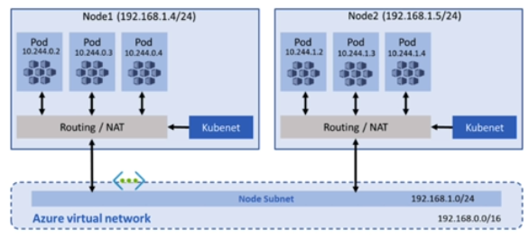

# Containers

> One option is to install `docker` on VMs. This may not be very efficiency however. 

## Azure Container Registry

> See Name

Has useful integrations with Azure K8s and other Azure services like Azure App Service.

Your uploaded containers will be under the `repositories` tab.   


## Azure Container Instance Service

This is a managed container service wherein you do not need to manage underlying compute services. 

You may also deploy multiple containers at once using container groups via `yaml` files.

Example file:

```yaml
apiVersion: 2019-12-01
location: eastus
name: expressappgroup0
properties:
    containers:
        - name: app
          properties:
              image: parthcr.azurecr.io/express-app:p80
              resources:
                  requests:
                      cpu: 1
                      memoryInGb: 1.5
              ports:
                  - port: 80
    osType: Linux
    ipAddress:
        type: Public
        ports:
            - protocol: tcp
              port: 80
    imageRegistryCredentials:
        - server: parthcr.azurecr.io
          username: parthcr
          password: PASSWORD_HERE
type: Microsoft.ContainerInstance/containerGroups

```

### Probes

+ Liveness Probes can determine if your *container* has had some failure. An example of this can be as `HTTP` probe which checks if your application is working. 
+ Readiness Probe: Checks if your application is ready to serve traffic.
+ Start-up Probe: Checks to see if your container has started successfully.

### Restart Policies

+ Always - restart on any exit code (*default*)
+ Never
+ OnFailure - restarted only when process executed inside the container fails (non-zero exit). Run at least once.

## Azure Container Apps

+ Fully managed container environment
+ Serverless 
+ Goal: Run Micro-services

When you deploy to container apps you select the type of compute backend you want and some scaling options. Azure will manage the scaling while you get a URL of the container deployed. 

## Azure K8s Service

> kubernetes...


+ You are able to upgrade your k8s cluster version at anytime.

### K8s Networking


You have two options:
1. Kubenet:  Node receive IP addresses from the Azure VNet. Then Pods receive a IP address from a logically different space with a NAT.
2. Azure CNI: Each pod gets an IP address from the subnet and can be accessed directly. 


Example of a **Kubenet**. Notice the IP ranges on the nodes and pods.


### K8s Storage

+ Azure File - File share which can be accessed by any node or pod
+ Azure Premium Disks - Only available to a single pod


