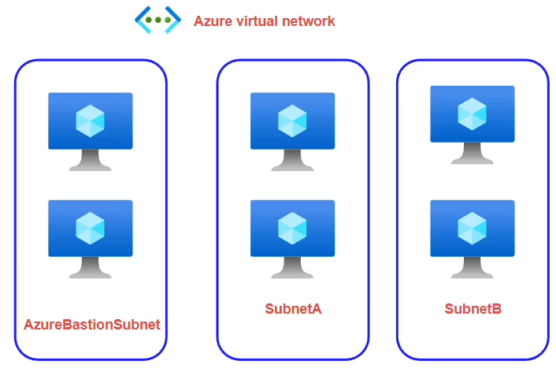

> VNets do not cost money.

Private Address Blocks
```
- 10 .  0.0.0 to 10 .255.255.255
- 172. 16.0.0 to 172.031.255.255
- 192.168.0.0 to 192.168.255.255
```

## Subnets

A subnet helps to isolate workloads within a VNet and allow you to easily apply *networking* rules to them. 

When creating a subnet, 5 IP address are reserved for Azure Usage. 

With azure a VNet can span multiple **non**-adjacent blocks of IP ranges. For example you can configure a VNet with address spaces: 
1. `10.0.0.0/16`
2. `10.2.0.0/16`

## IP Addresses

Each VM gets a (Virtual) Network Interface, which I will refer to as a `NIC`. This `NIC` is what gets a public & private IP address. Note however, a public IP address is its own resource. 

With azure, there are `dynamic` and `static` IP addresses. To obtain a `static` IP address. You need to select the `Standard` SKU over the `Basic` one (see below).  Dynamic IP address cost more per hour

Note: `Dynamic` IP addresses change on reallocation . 

**Important**: `Basic` IP address will be deprecated in 2025.

### Secondary `NIC`

You would want a 2nd NIC for:
+ Have on NIC be exposed to the internet while other deals with private networking

## Network Security Groups (NSG)

### NSG VM Level

Allows you to define at a `NIC`-level what traffic is allowed in and out of the machine via rules.

Rules must have source, which can be
+ Specific IP Ranges
+ Service Tags (you can allow/ban azure resources from your NSG)
+ Application Security Groups
+ `any` 

Rules must also contain a destination:
+ IP ranges (notice this will be the IP range of your subnet[^1])
+ rest is the same as the source rules.

Each rule has a priority, a lower priority number implies it is more important and evaluated earlier.  

### NSG Subnet Level

You can attach NSGs to Subnets as well. This way, all NSG rules apply to ALL resources under the governing subnet.

**Important**: If for example, you block `HTTP` at the subnet level but expose it at the `NIC`-level, the request will **NOT** get through.


[^1]: At the subnet level because the NIC is at the subnet level and NSGs are applied at the NSG level.

**TIP**: You should use a DenyAll rule with your NSG and then start allowing specific traffic. 

## Application Security Groups (ASG)

> Region Specific

Recall that the NSG can define rules based on IP Addresses, but what occurs when those IP address change but you are using IP addresses to control access to a service? This issue is worsened if there are many machines. 

The *solution* is to make each of your VMs part of a ASG and then use the ASG to control access to the resource (DB, other VMs, ...). This makes it so all you would need is one rule in your NSG to `allow` from your created ASG.

## VNet Peering

If you wish for resources in **different** virtual networks to be able to communicate to each other *without facing the public internet*, `VNet Peering` is required.

When peering the process must be reflexive. This means that Network $A$ must be peered with Network $B$ . This is active by default. See the terraform documentation: 

```text
allow_virtual_network_access - (Optional) Controls if the VMs in the remote virtual network can access VMs in the local virtual network. Defaults to `true`.
```


Terraform Code: `AZ-104/02 - Networking/TF Code/L3_vnet_peering`

## Azure Bastion (Service)


Consider the network above. Notice that the more machines we have the more IP addresses we need to consume and subsequently increase the number of IP-based attack vectors. 

The Bastion machines are used as a entry point to the machines in the rest of the network. For example any machine in the `AzureBastionSubnet` can be used to connect to via the  internet and then connect to the rest of the private machines in `SubnetA` or `SubnetB`. This is known as a "Jump Service".

Terraform Code: `AZ-104/02 - Networking/TF Code/L3_vnet_peering`

This setup can be used as you can Jump from `VM0` to `VM1`. Note the code does not use the bastion service.

If you wanted to use the bastion service you first require a **empty** subnet for the bastion machines to go into, this subnet needs to be called `AzureBastionSubnet`. Then via the Azure VM Service UI you can connect to the machine: `Connect -> Bastion -> Create`. 

## User Defined Routes

These allow you to *customize* routes packets will take in VNets. One example of this is if you would like all traffic routed through a central VM[^2].


[^2]: Notice this can help with security as there exists software to analyze packets.