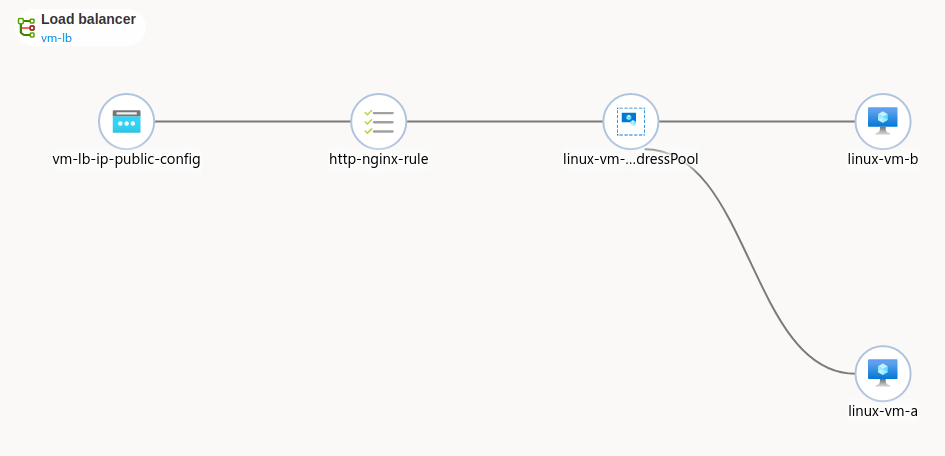
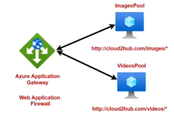

# Load Balancers

## Azure Load Balancer Service

Pricing in two SKUs:
+ Basic - No Features, No SLA
+ Standard - charged hourly but has SLAs and more features

Notice that with the Basic SKU, if your backend VM is highly available and you use a basic SKU you infrastructure is not HA.

Load balancer needs three things
1. Health Probe (monitor the health of backend machines)
2. Load Balancing Rules (who to direct traffic to and how)
3. Public IP address *if* LB is public

Below is a example of a LB. The code for this under `./TF Code/L1_LoadBalancer`.

---

### Other Load Balancer Details

+ LB works well with VMSS[^1] 
+ `Basic` LB will be retired Q3 2025
+ You may use Multiple Frontend IPs but its not like all of the IPs do the same thing. You have to configure the additional IPs with rules and health probes.
+ Session Persistence: You can configure the LB to have an affinity for sessions so as to route requests to the same machine that originally handled the session. 
### SKU: `Standard` vs `Basic`

+ Standard is for high scale and HA applications. Basic SKU is not compatible with AZs.
+ Backend Pool for Standard can be anything (as long as they are in the same VNet) but for Basic they need to be part of a Availability Set or a VMSS[^1]. 
+ Basic has no `HTTPS` health probe.
+ Basic has no SLA whereas Standard has 99.99%
+ Standard can have multiple backend pools which you can configure post-deployment. However, each of the LB rules cannot be the same. For example, a LB cannot route all `:80` requests to `:80` from both pools. The incoming port mappings must differ.
+ Public IP Sku and LB Sku **MUST** match

### LB Outbound Rules

> Only possible for `SKU:Standard`

You can allow the private machines inside the LB to access external services outside the VNet.

### NAT Rules

The TF code above configures **private** machines, meaning they do NOT have a public IP address and thus their state cannot be altered.  

With NAT rules you can log onto each of the machines under the load balancer. It allows you to create a mapping between the LB's Public IP and port to a private target machine and port.

## Azure Application Gateway

+ Web Traffic (Level 7) Load Balancer
+ Routing decisions are made based on HTTP attributes

The WAF is used to protect against web-based attacks.

The gateway can point to:
1. Backend Pools
2. VMSS
3. Azure Web Apps
4. On-prem Servers

### Setup

+ The Gateway needs its own **empty** subnet because it needs to provision its own compute machines which you can set to be auto-scale or not.
+ Then you must set up http listeners and backend pools to route traffic to based on conditions like HTTP paths

### Multi Site

This is if you have multiple domains and you would prefer different domains are mapped to different backend pools.

This implies that if you had $n$ domains, you would need $n$ listeners and $n$ rules. 

[^1]: Virtual Machine Scale Set
