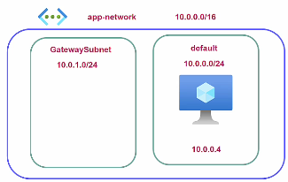
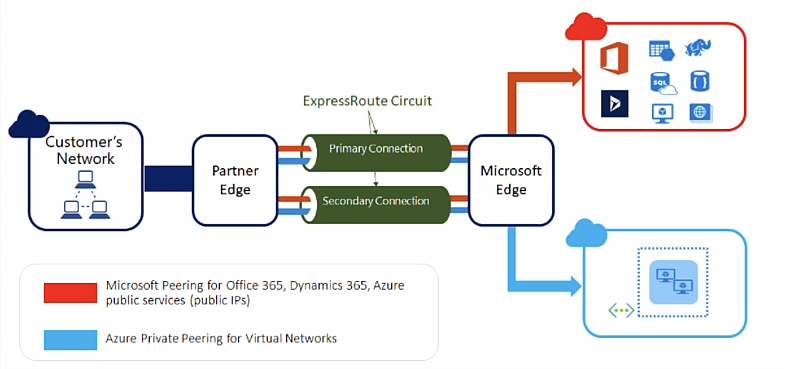

# VPNs

## Point-to-Site (P2S) VPN

Allows the secure creation of a connection between machines in the Azure Network and the Client Machine.

**Usage:** You can use these type of VPNs to host application that are not supposed to face the internet. 

You are required to have a `GatewaySubnet` to host gateway VMs which are used to route your request to the correct machines and services. No other VMs can be hosted.

There are many VPN gateway types (SKU). Each differ in connection limits and bandwidth.

Note the P2S configuration needs a IP address pool to assign to connected clients. Notice this address pool cannot intersect with your subnet or VNet address pool. 

Once the VPN is installed and you are authenticated (see Below) you can now access private machines on the VNet.

**Note**: If you make major changes like peering VPNs you will need to *redownload* the VPN client.

## Site to Site (S2S) VPN Connections

This when you want to connect your on-premises network to your VNet. 

This requires a `local gateway`. This resource acts as the "VPN device" in the S2S connection. It requires information about your on-premises network.  
## Auth

When connecting via VPN there needs to be authentication. 

One option is certificates which allow you authenticate machines onto the network. Other options involve Entra ID.

### Steps

1. Deploy a gateway subnet.
2. Deploy VPN Gateway. This allows you to send traffic over the MS backbone network
3. Deploy a Local Network Gateway, this represents the hardware/software on-prem
4. Deploy the VPN Connection

## Azure Virtual WAN

> A WAN (Wide Area Network) is used when you want to connect your many on-premises networks and VNet(s). Best suited for larger organizations. 

**Problem**: A Virtual Network Gateway can only be connected to one VNet at a time. If you want to extend this network you have to peer. Note, Virtual Network Gateways already support Multi-site access. The complication occurs with multiple VNets.

**Solution**: Azure Virtual WAN

There are two SKU: `basic`, `standard`. With basic you get `S2S` connectivity only.

### Virtual WAN: *Virtual HUB*

A Hub is a central component for managing network resources via a hub and spoke architecture. Each hub needs its own private IP range to host resources for routing. 

According to documentation, a hub *is* a managed VNet with various endpoints to facilitate connectivity. Note, you **cannot** put things into or see this VNet. 

This is unlike the previous gateways discussed. To get into the network all network traffic goes though the hub. Then you would peer external VNets to the managed VNet (*the hub*) and you would get access to the services inside the VNets.

All hubs are connected to each other implying two users on this WAN can communicate. 

**Why would anyone use a WAN *over* simple S2S or P2S VPNs?** Those VPNs have a much smaller limit on active connections whereas the WAN can handle thousands of connections.

# Azure ExpressRoute (ER)

ER allows you to connect your on-premises network to the Microsoft cloud over a private connection. 

The pros of ER:
+ Does **not** use the public internet
+ Connections are faster are more reliable with less latency
+ You get two connections for each ER circuit for redundancy (See Image)

### ExpressRoute Peering

This peering connection allows you to connect with VMs and other PaaS services deployed on a Azure VNet via private IPs. This does required a Virtual Network Gateway.

There is also something called "Microsoft Peering" which allows connectivity to MS365 and other Azure PaaS Services.
