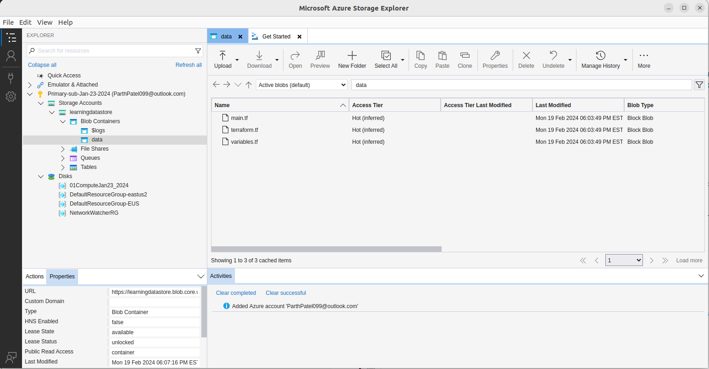
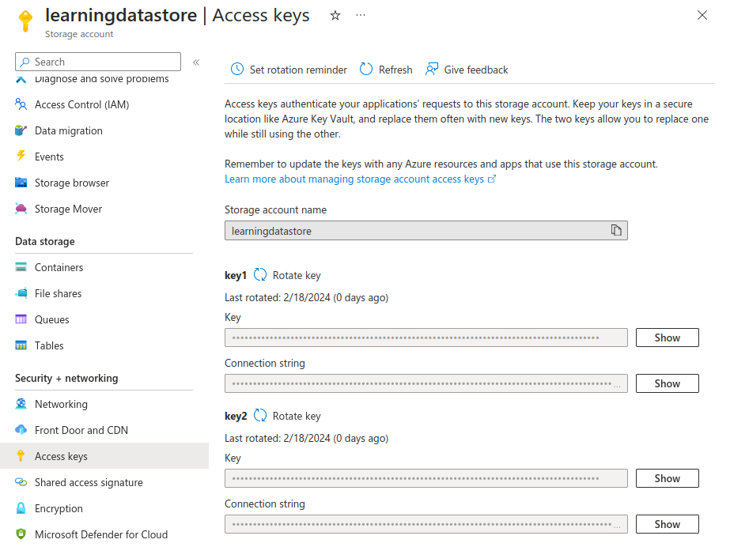

# Storage Accounts
## Intro

Storage accounts is a service to persist data on azure with scalability. It is just named badly: it is **not** another account inside your already existing account; it is simply a container for all your storage services and saved data. Under this "account" you have access to many services under a namespace like Queue[^1], tables, CDNs, ... .  

## Azure Blob Service

> Optimized for storing unstructured data. 

To start storing data you need a container. All uploaded items are treated as `objects` that are **URL-accessible**.[^2]

Microsoft recommends using Azure Storage Explorer, a GUI tool to help look at your saved items visually.

Here is what it looks like:

### Authorization 

By default, all objects and containers[^3] are set to private access. 

We have three methods of Authorization:
1. Access Keys
2. SAS - Shared Access Signatures 
3. Azure AD Auth

#### Access Keys

Each SA has two access keys:

The connection string is used by SDKs to connect to the storage account. 

*Con*: These keys grant **full** access to the storage account.

#### Shared Access Signature

A shared access signature (SAS) is a URI that grants restricted access rights to Azure Storage resources. You are able to select:
+ type of access (container, file, ...)
+ length of access
+ operations permitted (read, write, delete, ...)
+ Allowed IP addresses

A SAS token/URL can be generated at the Blob Level (individual object) or at the storage account level. The latter having more options such as being able to give access to only a certain service like `blob` or `queue`. 

**Key Invalidation**: SAS Tokens ads URLs are generated via one of the access keys as they are used as a Signing key. To invalidate a SAS, rotate the signing key.

##### SAS: Shared Access Policy

> At the container level.

The first step in using a Shared Access Policy is selecting a permission type (Read, Write) and a Policy duration. This approach of granting access to a container is better then a SAS because to revoke access you simple remove permissions from the policy used to grant it. 
#### Azure AD Authentication
??

## Copying Data

There are many methods of moving large amounts of data between Azure and on-prem. There is:
1. Azure Import/Export Service

In the portal the above service will track your copy progress. Microsoft will send you drives you can use for the copy job. The drive can be encrypted and it will have journal-ing enabled. You are then required to ship this drive back.

This is similar to Azure Data Box where no internet is used to copy files only raw data transfer tools. This is used in no-internet situations where large volumes (GB, TB) need to be moved.

You can also use [azCopy](https://learn.microsoft.com/en-us/azure/storage/common/storage-use-azcopy-v10) to move items to Storage accounts via things like SAS (Shared Access Signatures)
### Blob Versioning

A SA can be set to keep versions of a blob. You are able to revert to a prior version if needed.

### Storage Account Networking Settings

+ By default it is public to the internet
+ People can connect to the SA if they have the valid keys

To make it more secure you are able to disble all public access and allow access only for some.

Another option are VNet Service endpoints. One a endpoint is created the VNet can be added to the SA's list for allowed traffic under the netwrk tag.

#### Service Endpoints

> Cannot be used for `on-prem` -> `azure`

VNet Service endpoints provide a secure and direct connection to azure resource over a optimized route. Moreover this feature allows resources in the same subnet to communicate without using the public internet. 

This feature is important as it comes with "service endpoint policies" which can help you block and filter traffic.

#### Private Endpoints

A NIC is used to connect you and your service privately. 

> [Docs](https://learn.microsoft.com/en-us/azure/private-link/private-endpoint-overview): This network interface connects you privately and securely to a service that's powered by Azure Private Link.

One of the supported services is Azure Storage Accounts. A good way to thing about using these Private Endpoints is that it is like bringing the resource ov 

## Premium Storage Accounts

Premium is one of the options in the `performance` section of SA creation. This allows you to select between three types of latency optimized Storage Account Types:
1. Block Blocbs (Low Storage Latency)
2. File Shares (Scalability)
3. Page Blobs (Random Read/Write Optimized)

**Important Note**: Many of the redundancy options (ex: GZRS) are not available on Premium SAs. This is one of many things not available, storage tiers (`hot`, `cool`, ...) also do not exist[^4].

The performance is achived by keeping data on faster SSDs and the storage cost is lower in terms of transaction cost but higher in terms of storage cost when compared to standard SAs.

[^1]: Unsure why Queue Service, is under Storage accounts since its an Event-Driven queue messaging service. 
[^2]: By default, all objects are set to private access. 
[^3]: Containers are just "folders" that hold Blobs that aid in organization
[^3]: They cannot be changed.
