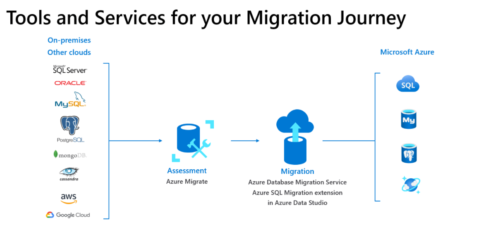

# Migrations

Most companies already have things they need to migrate (DB, VMs, Storage Drives, ...). 
Sometimes knowing what to migrate is hard. It is an additional challenge trying to move a existing/running application. To put it shortly, migrations are risky.

## Data Migration

One thing to understand, data is always changing and sometimes large[^1].

One of the solutions to the large data issue is Azure Data Box, it is a physical service in which Microsoft will send over a drive based on your size requirements which you can fill and ship back to ensure it appears on Azure when they upload it. Another method is `AzCopy` which is a `cli` tool that can help you manipulate Azure Storage Accounts.  

There is a Data Migration Assistant which helps migrations by creating deltas where it will help you move data in and compare it to the last upload date to not waste your time. This also exists for SQL DBs and is referred to as `Azure SQL Database Migration`. 

The Database Migration Service helps to migrate on-prem SQL DBs to Azure automatically, the DBs can be deployed via many methods[^2]. 

One alternate method for migration is ASR[^3] where you can use ASR to backup your DB from other CSPs or On-prem and then perform a failover to migrate.

## Application Migrations

1. Application Rehosting - "Lift-and-shift"
	+ Involves minimal changes but hosting it on the code
2. Application Refactoring
	+ Using the Cloud features like moving cloud DB (Cosmos or SQL)
3. Application Rearchitect
	+ Rebuilding your workload for the cloud (ex: using EventHub or using Entra ID) 
4. Application Rebuild

## Storage Migration

1. Lift-and-shift
2. Storage Migration Agent
	+ A tool of this name can be installed on your computer to automatically scan and build required resources like file shares and security permissions. 

[^1]: GB, TB, PB
[^2]: Ex: VM running SQL or Azure SQL Service
[^3]: Azure Site Recovery