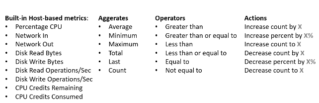

1. Azure Virtual Machines
2. Azure Container Instances (Like AWS Fargate)
3. Azure Kubernetes Service (Managed)
4. Azure Service Fabric: Distributed Service Platforms (on-prem); to be used with MicroServices 
5. Azure Functions
6. Azure Batch: Plan and schedule workloads in parallel with spot VM availability  

## Azure Virtual Machines (AVM)

> Billed to the *second*.

You need to:
+ Apply OS Patches
+ Install required packages

You will **not** need to manage hardware.

The VM specs are determined by the image (CPU, RAM, Storage, ...) and you are allowed 20 VMs per region per subscription. One machine can have multiple managed disks.

### AVM Reservations

**Azure Reservations** help you save money by committing to one-year or three-year plans for multiple products by providing upto 72% discounts. You can pay for a reservation monthly or upfront. 

> **Unlike AWS**, the *total* cost of the monthly and the upfront is the same. 

The above refers to "reserved instances", the "reserved capacity" refers to managed database services usually. 

### Resources Related to AVMs

+ NSG - Network Security Group: Attached to the NIC, contains firewall rules for ports/protocols
+ NIC - Virtual Network Interface Card
+ Each VM gets a Public IP if enabled
+ VNet - Virtual Network your VM will spawn in (like AWS VPC)
+ ASG - Application Security Groups. ASGs allow you to group VMs and apply security rules.

### AVM Operating Systems

> Determined from the VM image

Images can come from the Marketplace where partners can host images for free/paid use.

### Azure Scale Sets

This is used to scale VMs (via Load Balancers) when needed or remove unhealthy instances based on failed health-checks.

There are two load balancer options: 
1. Application Gateway (HTTP/s)
2. Azure Load Balancer (TCP / UDP)

#### Scaling Policy

> Determines when a VM should be added or removed to fit capacity requirements

Once a scale set is created you have many options on the conditions (CPU Util., Network in, Network out, ...). 

Here are some examples of policy settings:

You can get more metrics with **App Insights** which can allow you to choose app-based metrics like Page Load and Session Counts. If you want more information about the VM you may install the Azure Diagnostic Extension within the VM.

##### Scale-in Policy

There also needs to be a policy that removes VMs when they are not needed.

You can choose between default (VM with highest instance ID), newest VM, or oldest VM.  

##### Update Policy

This determines how VMs get updates. You can choose:
1. Automatic (ramdom)
	+ You can set OS to be automatically upgraded. 
1. Manual 
1. Rolling (Batched updates with optional pauses)

#### Health Monitoring 
 There are two modes:
1. Application Health Extension 
	+ Send a HTTP request to a specific path
 2. Load Balancer Probe 
	 + Allows you to check based on TCP/UDP or HTTP requests, can you used with automatic repair to remove/attach new instances. 

### Azure Virtual Desktop

Does what you think it does. 

It has:
+ Great MS Suite Integration
+ Reduces costs on licensing 
+ Has great backup: Azure Site Recovery and Azure Backup
+ Simplifies IT management 
+ Simplifies Security with Azure Active Directory