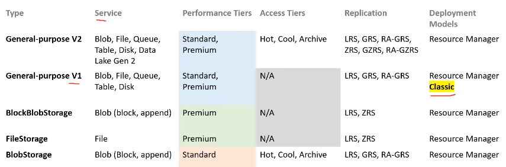
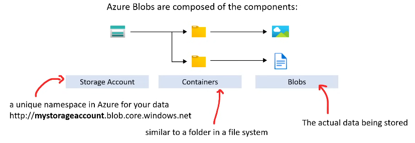
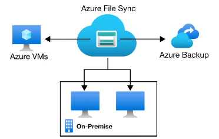

1. Azure Blob Storage - (AWS S3) Serverless Storage and unstructured.
2. Disk Storage - Virtual Volume usually attached to VMs. Can be SSD or HDD
3. File Storage - Shared volume you can access and manage like a file storage
4. Queue Storage - Data Store for queuing and reliably delivering messages between applications
5. Table Storage - Wide Column NoSQL DB (schema-less)
6. DataBox / DataBox Heavy - Rugged Briefcase computer and storage used to move tera/petabytes of data
7. Azure Archive Storage - Long term cold storage to be held for years.
8. Data Lake Storage - Centralized Repo that can hold structured and unstructured data.
## Service: Storage Accounts

> Contains all your azure storage data objects like: *blobs*, *files*, *queues*, *tables*, and *disks*.

There are many types of storage accounts and each has different features and pricing. 

+ General Purpose
	+ There is V1 and V2 but V1 is legacy.
+ Blob Storage
	+ There is BlobStorage (legacy) and BlockBlobStorage 
+ File Storage

Each Storage account varies on what features it exposes. They many vary in
+ Supported Services (Blob, Queue, Tables, Containers,...)
+ Performance Tiers (R/W Speeds)
+ Access Tiers
	+ Hot; Cool; Archive
+ Replication 
+ Deployment Model

> You can think of a storage account as a top-level container or namespace for organizing and managing your data within Azure Storage.

### Performance 

There are two types of tiers: Standard (HDDs) and Premium (SSDs). 

### Versioning 

> Only possible for Blob Storage

> When blob versioning is enabled, you can access earlier versions of a blob to recover your data if it's modified or deleted.
> Taken From [Docs](https://learn.microsoft.com/en-us/azure/storage/blobs/versioning-overview)
### Access Tiers

> Warmer = more frequently accessed data. 

1. Cool
2. Archive - Rarely accessed and **cannot** be deleted. Requires rehydration[^1]. Early deletion charges are applied if deleted before 180 days.
3. Hot

When uploading Blobs you may choose a tier that is not the default you set and you can move Blobs. There are also life-cycle events where you can move blobs to different tiers based on access rules. 

Any object moved into *cool* or *archive* is subject to a early deletion period of at least 30 days.

**Note**: You can only set cool or hot as default upload tiers.
#### Billing

Billing occurs per GB and per 10K (R/W) operations. The billing occurs at the destination tier (see above for tier information) of the operation.
#### Data Redundancy and Replication 

There are three levels of pricing

1. Primary Region Redundancy
	+ LRS (Locally Redundant Storage)
	+ ZRS (Zone-Redundant Storage)
2. Secondary Region Redundancy
	+ Geo Redundant Storage
	+ Geo-Zone Redundant Storage
3. Secondary Region Redundancy with Read access
	+ RA (Read Access) GRS
	+ RA - GZRS

Notice at the bare minimum, data is replicated three times.

##### Primary Region Redundancy
Data is replicated 3 times in the primary region in the same AZ selected. 
###### LRS

> 11 9s

Copies data synchronously in the primary region

###### ZRS

> 12 9s

Copies data synchronously in the primary region across 3 AZs

##### Secondary Region Redundancy
Used to replicate to a 2nd-ary region in-case of primary disaster. The secondary region is determined by your primary-region, you cannot start reading/writing to your secondary region unless there is a primary failure.

###### GRS

> 16 9s

Copies your data synchronously in your primary region while copying asynchronously to another region. 

###### GZRS

> 16 9s

Copies data synchronously in the primary region across 3 AZs while copying asynchronously to another region **ONLY** to one AZ.

##### Secondary Region Redundancy with Read access

This is the same above  (Secondary Region Redundancy) but all copies are synchronous to allow for read-replicas. 

## Core Storage Services

1. Azure Blob - Scalable Object store for text and binary data. Does support big data analytics under Data Lake Storage Gen2.
2. Azure Files - Managed File Shares[^2] for deployments 
3. Azure Queues - Messaging 
4. Azure Tables - NoSQL schema-less store for structured data 
5. Azure Disks - Block level storage for Azure VMs.

> 1-4 involve storage accounts.

### Azure Blob Storage

#### Blob Types

1. Block Blobs
	+ Store Text and binary
	+ Made up of blocks of data that can be managed individually
	+ Max: 4.75 TiB
	+ You choose the block-size when you upload an object
2. Append Blobs
	+ Optimized for append operations
3. Page Block
	+ Store random access files upto 8TB in size
	+ Used often for storing VHD (Virtual HardDrive Files)

### Azure Files

Managed file share[^2] in the cloud using SMB (Shared Message Block) or NFS (Network File System) protocols.

You are to mount this volume when using it.

### Azure File-Sync
Azure file-sync allows you to cache Azure Files on a machine (VM or on-prem). You can use any protocol thats available on Windows Server.

### AZ-Copy

CLI Util to copy blobs/files between storage accounts

### Azure Storage Explorer

Standalone app to make it simple to work with Azure Storage on any platform. 

[^1]: Rehydration is the process of moving to a different tier before some action can be taken.
[^2]: File Shares: shared network drive or directory that allows multiple users or systems to access and store files.