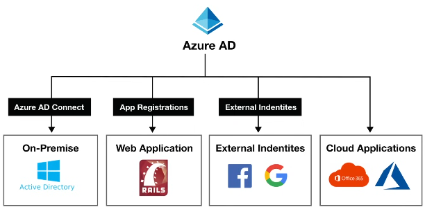

**IMPORTANT**: MS has **RENAMED*** Active directory to EntraID. Any mention of AD in this note or future notes refers to Azure Entra ID.

## Vocabulary 

**Domain** - An area of a network organized by a single Auth DB. An AD Domain is a logical grouping of AD objects on a network.

**Domain Controller** - Server that authenticates identites and authorizes access

**Domain Computer** - computer registered with a central auth DB. A computer has to *join* the AD network.

**AD Objects** - Objects like Users and Computers that are basic AD elements

**Group Policy Object** - A collection of policy settings that controls what AD Objects have access to.

**Organizational Units** - A subdivision with an AD where you can place AD objects for organizational value.

**Directory Service** - Known as *AD DS* , provides the methods for storing directory data and making it available of network users and admins. This service runs on the domain controller. 

---

> Identity and Access Management Service

 Cloud based identity and access management service to manage users, sign-ons, and anything AD-related.

You can use AD to limit access to external (ex: Office 365) or internal (ex: Access to On-Prem PCs) resources. AD can also be used for **SSO** as it can be used to authorize and authenicate.

There are 4 editions of AD 
1. Free - MFA, SSO, Basic Security and Usage Reports, User Management
2. Office 365 Apps 
3. Premium 1 - Advanced Group Access and Conditional Access
4. Premium 2 - Identity Protection and Governance

### Active Directory Vs ***Azure*** Active Directory

Active Directory as existed since 2000 and it existed to give companies the ability to manage many on-prem components via a single identity per user.

***Azure*** AD simply takes it to the cloud.

## Microsoft Active Directory Services

You may need to set up your own domain controller if Entra ID does not support all of your needs: it does not have all of the domain services you need.

The current *managed* domain services are:
1. Domain Joins
2. Group Policies
3. LDAP
4. Kerberos / NTLM Auth

### SSO

SSO via Entra ID is a feature that allows users to authenticate once with Azure and access multiple applications without re-signon. This is done via a security token which is generated on signon.

SSO types supported:
1. OpenID / OAuth
2. SAML
3. Password-Based
4. Linked (Using external IDPs)
5. IWA - Integrated Windows Auth
6. Header-Based Auth - Each request intakes a token which is validated and authenticates the user.

#### External Identities

> "bring your own Identity" (Google or FB login)

This allows people outside your ORG to access your apps with their own identity. For example, Azure AD B2C allows for white-label creation of apps.

### Conditional Access

Implemented via Conditional Access Policies which are a set of rules that specify the conditions under which sign-ins are evaluated and allowed.

Conditional Access Policies analyze:

1. Signals
	+ Signals are metadata associated with an identity attempting to gain access.
	+ Signal Examples:
		+ User or group membership
		+ Location (IP or etc.)
		+ Device
1. Verify every access attempt via Access Controls

### Entra ID Connect

Microsoft Entra ID Connect installs an on-premises service that orchestrates synchronization between your on-premises Active Directory and Microsoft Entra ID. It contains a ADSync Service which copies the server data.

### Entra ID Protection

+ automates detection and remediation of identity-based risks  via Signal (see more about signals above) analysis
+ Investigates risks 
+ exports risk data for analysis