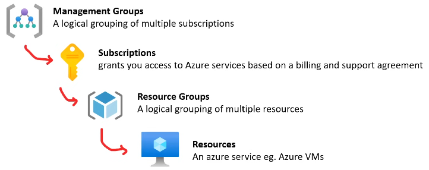

## Azure Portal

The Azure Portal is the web-based frontend of Azure and serves as the alternative to the CLI. You can do anything via the portal.

You can utilize new features you can use `preview.protal.azure.com`.

**Note**: For below sections, remember that you can use Azure Powershell, Azure CLI, and Azure Portal on any Linux, Mac, or Windows based machine. 
## Cloud Shell

Azure cloud shell[^1] is a web-based shell which is authenticated and is used for managing Azure resources.

## Powershell

> Command line shell and scripting language


Powershell is built on top of the `.net` runtime and returns these objects. Azure has a set of cmdlets for managing Azure resources via the CLI.

## Azure CLI

The Azure CLI can be installed on most platforms and once installed you can start commands with `az`. 

The docs are contained at: [Docs](https://learn.microsoft.com/en-us/cli/azure/reference-index)

Examples of usage:

```shell
parth@LM-parth:~$ az group create --location 'eastus' --name 'azure-cli-test-group-001-blob' 
{
  "id": "/subscriptions/{SUB_ID}/resourceGroups/azure-cli-test-group-001-blob",
  "location": "eastus",
  "managedBy": null,
  "name": "azure-cli-test-group-001-blob",
  "properties": {
    "provisioningState": "Succeeded"
  },
  "tags": null,
  "type": "Microsoft.Resources/resourceGroups"
}
```


## Azure Advisor

**Azure Advisor** is a personalized cloud consultant that helps you follow best practices to optimize your Azure deployments. It analyzes your resource configuration and usage telemetry and then recommends solutions that can help you improve the cost-effectiveness, performance, reliability, and security. 

## Azure Resource Manager (ARM)

> Collection of services that represents the 'management layer'

Allows you to
+ CRUD updates
+ Apply management features (Access Control, Locks, Tags)
+ Writing IaC via JSON
	+ Define variables in JSON for reuse  

All requests flow through ARM and it determines if the requested action can be preformed on the resource. 

### ARM Scoping

A scope is a boundary of control for azure resources; it is a way to govern your resources by placing resources within a logical group and applying rules to the group.




### ARM Templates

> This is Azure's IaC

These are **declarative** JSON files that define azure resources for IaC. They are used to setup, share, modularization, test, and teardown your infrastructure. 

Each resource group has a ARM Template that can be used; this is not possible on other cloud providers like GCP or AWS. The IaC ARM Template is stored under the resource you created.

### Azure Bicep

> Efficient method for generating Azure IaC. 

Azure Bicep is IaC language.


[^1]: Comes in Bash or Powershell.

